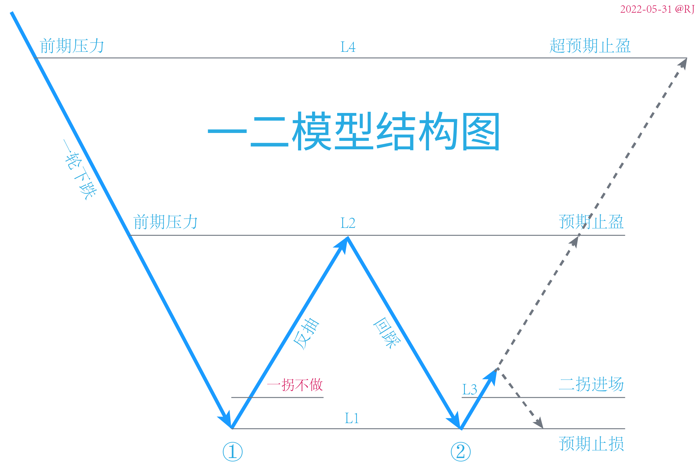
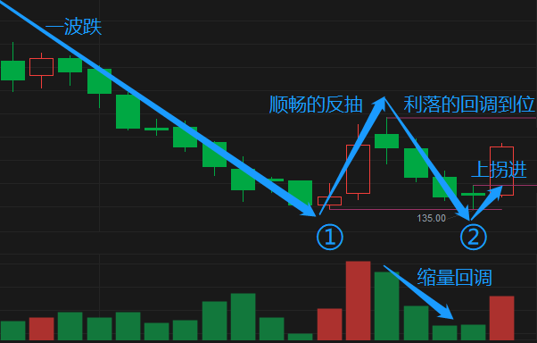
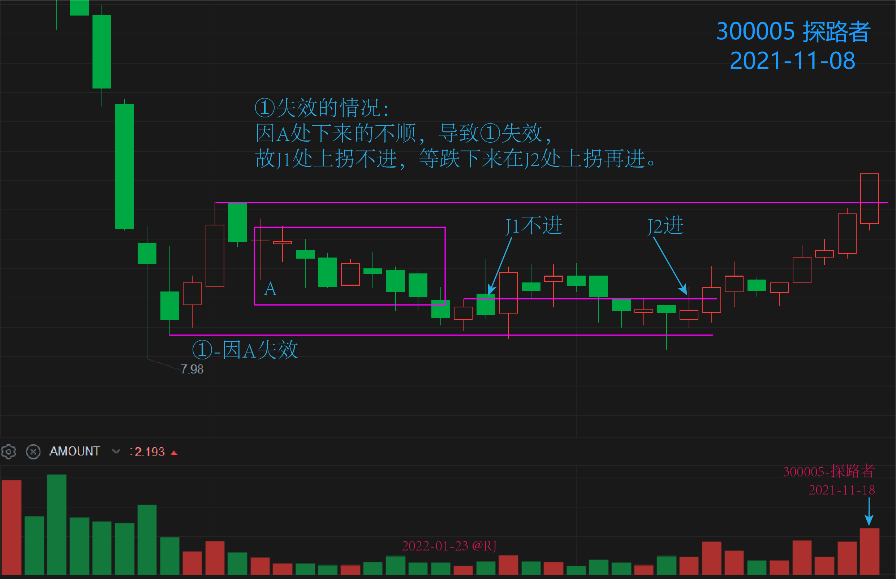
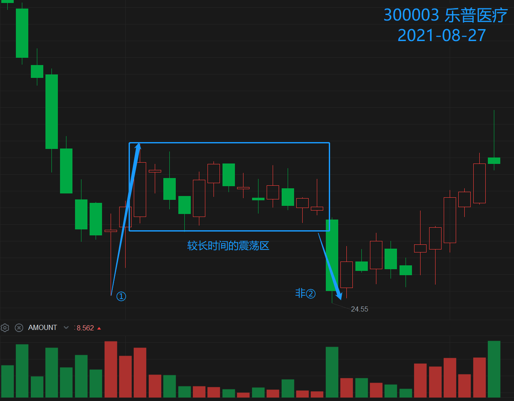
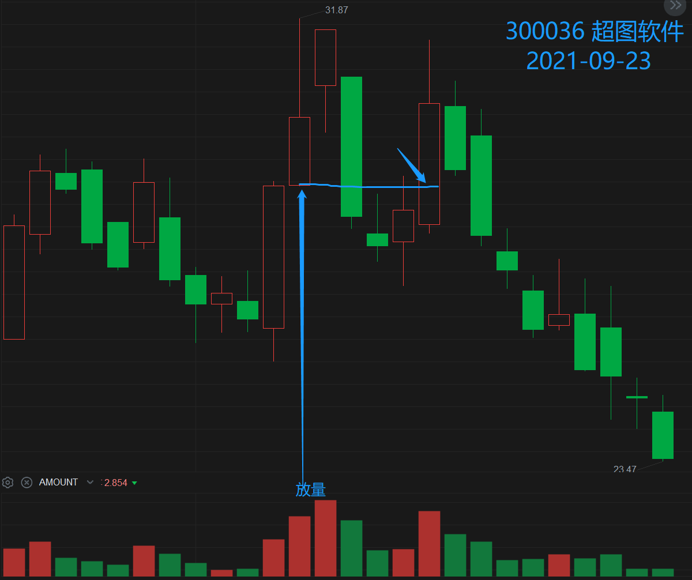
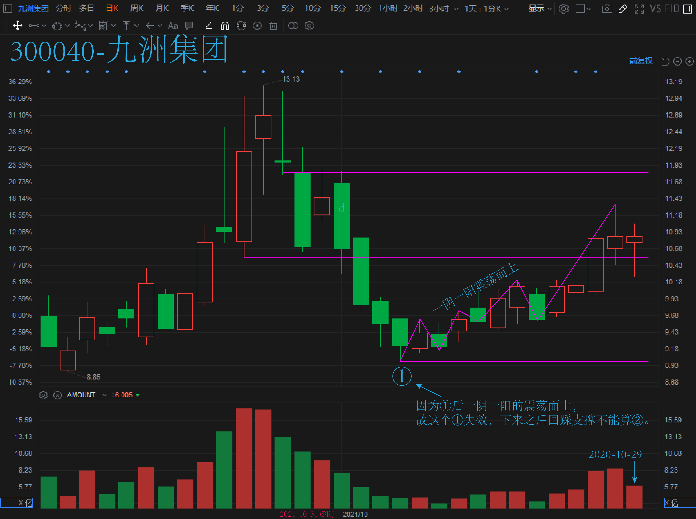

# 盈线模型之一二

一二模型又叫一不做二不休模型。

## 1. 模型结构

## 2. 模型特点

1. 一轮下跌后拐头向上出现一个反抽，形成①。
2. 在反抽的最低处画一条水平线 L1。
3. 反抽到一定高度后拐头向下，此时在反抽的高点处也画一条水平线 L2。
4. 反抽后回踩 L1 线，但没有被有效跌穿。
5. 下一根 K 线过前一根回踩 K 线的上盈线 L3，形成②。

## 3. 进出场

- 进场：突破回踩 K 线的上盈线 L3。
- 止盈：
    1. 突破①的反抽高点 L2 后折返。
    2. 上涨过程中出现 K 线拐头。
    3. 突破昨高后折返。
- 止损：
    1. 跌破进场 K 线的低点 L1。
    2. 如果 L1 离下方支撑位很近，等跌穿下方支撑位再止损。
- 平仓：跌破进场点 L3。

## 4. 补充细节

**加分项：**

1. 当①的拐点和②的拐点位置几乎在同一水平位置时，效果最好。
2. ①和②之间不能间距太长，须是近期的，间距越短，效果越好。
3. 反抽越顺、回踩越顺，效果越好。
4. 回踩缩量效果最好。
5. 将预期止盈线从反抽高点改为反抽次高点，风险最小利润最大。
6. 观察它左边是怎么跌下来的，跌下来过程中各个结构的高低点都有可能是后期上涨的阻力，观察二拐后在各级阻力的表现，择机离场能最大限度降低风险和保住利润。

**减分项：**

1. 反抽上去的不顺，①失效。
    > 如连续阳线直接上去的，就是上去得很顺。
2. 反抽下来的不顺，①也失效。
    > 如连续阴线直接下来的，就是下来得很顺。  
    > 反抽高位处做了结构再掉下来的二拐也不能算②。
3. ①失效后，回踩反抽低点的上拐不能算②，要重新算①等②。
4. 反抽高点处放量跌下来的，放量 K 线的低点是后期很大的阻力。

## 5. 模型变换

1. 当 L1 被有效跌穿，第二天在 L1 上方高开上拐，按**回马枪**模型做。
2. 当 L1 被有效跌穿，之后在靠近 L1 下方震荡几根 K 线，然后突破震荡区间涨回 L1 上方，按**返回箱体**模型做。
3. 若①处反抽的上方空间足够大，可在①处进场，按**V型反转**模型做。 

## 6. 附注

Q：为什么不做①做②？  
A：①的作用是消化一下之前跌下来的一些上方套牢盘，有了①后，②继续向上突破的可能性更高，上方空间才更大。

## 7. 选股公式

1. [Y0101-选股公式](./Y0101-选股公式.md) 及其 [案例回测](./Y0101-案例回测.md)。

## 8. 案例图集

### 8.1 优秀案例

TODO

### 8.2 ①失效的情况

**下来的不顺：**

**①上去后有个较长时间的震荡区：**

> 为什么不直接上去呢？因为①上去后上面有个较长时间的震荡区，回踩下面的支撑后，需要震荡一下消化上面的筹码先。

**放量（倍量）低点是阻力，过了才能进：**

**一阴一阳震荡而上：**

