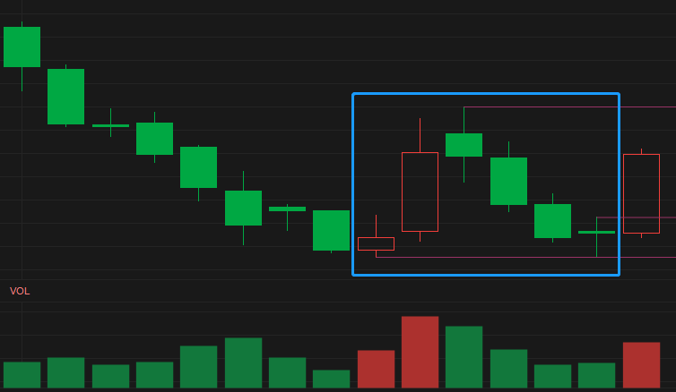

> [查看模型](./README.md)、[查看案例](./Y01-案例.md)

# 一二模型的公式

适用范围：通达信 PC 版及 APP。

## 1. K 线组合图



- 来源：688037 芯源微 2022-01-24。
- 简述：小阳加大阳反抽后缩量跌三天，第四天跌倒支撑附近，第五天上拐进。

## 3. 参数

- D：回调低点的允许偏差，`[1,5]`，默认 1，表示允许偏差 ±1%。

公式的用法注释：

```
基于 688037芯源微 2022-01-21 的6K线①②结构的选股公式，参数D为①②低点允许的偏差（±D%）。
执行条件选股时勾选 “时间段内满足条件”，设置日期范围，即可选出历史案例。
以往选股案例（D=1时）：
1. 2022-01-21 688037-芯源微 
2. 2022-01-21 300360-炬华科技
3. 2022-05-27 002923-明德生物
```

## 4. 代码

```txt
{Y01V2_一二模型}

{模型K线数量}
N1:=6;
{①前一波跌的周期数}
N2:=20;

{排除 K 线数量不足的股票}
K_ENOUGH:=TOTALBARSCOUNT>=N2+N1;

{1. ①前为一波跌，跌幅≥20%}
YBD_L:=REF(LLV(L,N2),N1); {一波跌的低点}
YBD:=REF(HHV(H,N2),N1)/YBD_L>=1.20; {跌幅≥20%}

{2. 一波跌后出现小阳，为①的起点}
XY:=REF(C,N1-1)>REF(C,N1)           {阳线}
  AND REF(C,N1-1)/REF(C,N1)<=1.03   {涨幅≤3%}
  {小阳低点接近一波跌的低点，可偏差±D%}
  AND REF(L,N1-1)/YBD_L<=1+D/100
  AND REF(L,N1-1)/YBD_L>=1-D/100;

{3. 小阳后为大阳，为①的确立，涨幅≥6%}
DY:=REF(C,N1-2)/REF(C,N1-1)>=1.06;

{4. 大阳后连跌到①的低点附近，为②的起点}
LD:=LAST(H<REF(H,1) AND REF(L,1),N1-4,0)     {0~2周期的K线高低点不断降低}
  AND LAST(C<REF(C,1) AND V<REF(V,1),N1-4,1) {1~2周期的K线收盘价连跌及缩量}
  {连跌低点接近①的低点，可偏差±D%}
  AND REF(L,0)/REF(L,N1-1)<=1+D/100
  AND REF(L,0)/REF(L,N1-1)>=1-D/100;

{合并条件}
RJ:=K_ENOUGH AND YBD AND XY AND DY AND LD;

{条件选股}
RUN:RJ

{主图：在选股日K线下方绘制①②字}
{DRAWTEXT(RJ,LOW*0.99,'①②');}
```

注：解除 “条件选股” 和 “主图指标” 下的相应代码来切换使用方式。