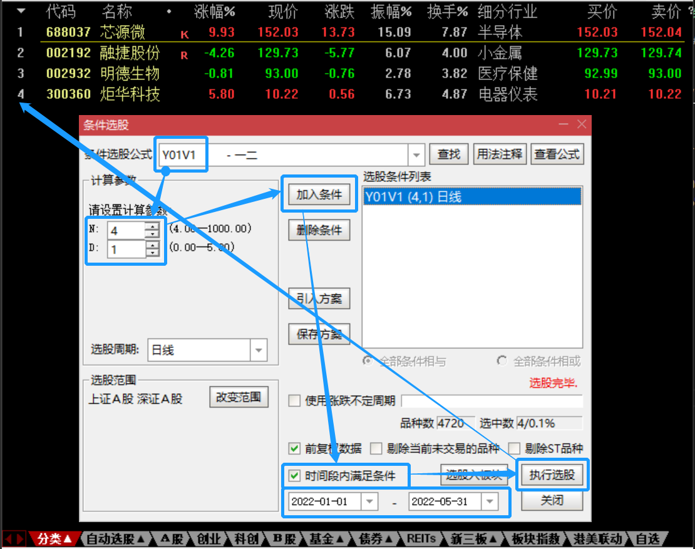
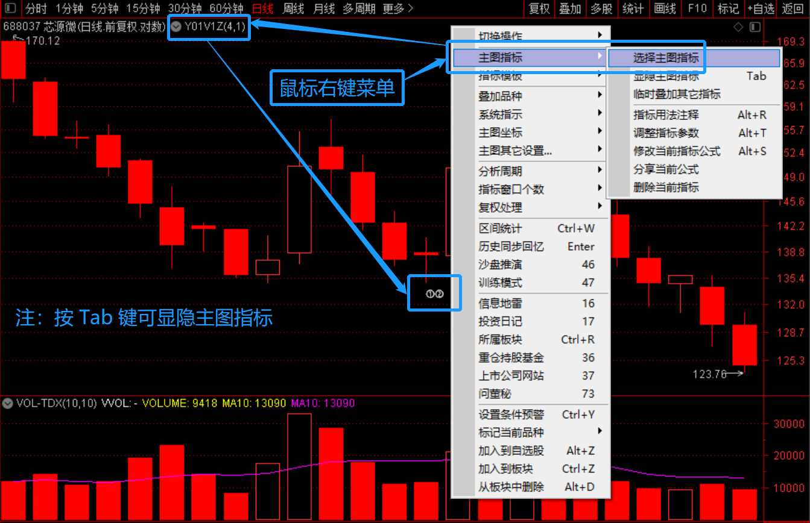
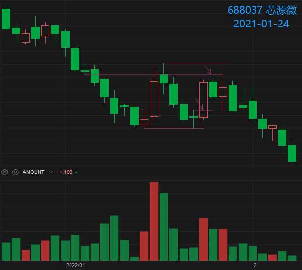
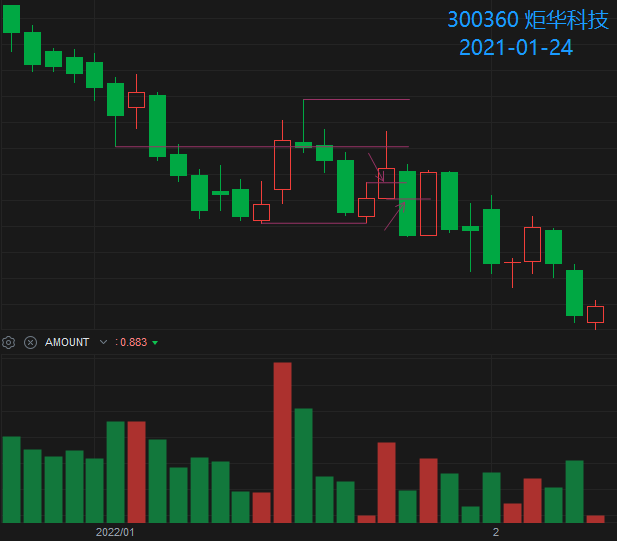

> [查看模型](./README.md)、[查看公式](./Y01-公式.md)

# 一二模型的案例

| 选股日   | 上拐日   |      案例       |   1D    |   2D   |   3D   |
|:--------:|:--------:|:----------------|--------:|-------:|-------:|
| 22年1月
| 220121W5 | 220124W1 | 688037-芯源微   |  +8.60% | -3.36% | +2.25% |
| 220121W5 | 220124W1 | 300360-炬华科技 |  +2.96% | -6.29% | +6.33% |
| 22年5月
| 220527W5 |   -    | 002932-明德生物 |         |        |        |

- “选股日” 为盘后通过选股公式选出标的日期。
- “上拐日” 为标的选出后触发进场信号的日期，值为 “-” 代表没有触发进场信号。
- “220121W5” 为 “2022-01-21 周五” 的简写。
- 1D 为上拐进场当天的涨幅。

## 1. 条件选股

- 取消勾选 “时间段内满足条件” 为盘后选股。
- 勾选 “时间段内满足条件”，设置时段范围后可选出历史案例。

## 2. 主图指标

添加后会在 K 线图上的选股 K 线的下方绘制 `①②` 字样。

> 指标名称为在选股名称后添加后缀 Z，如 Y01V1Z。

## 3. 案例截图

### 2022-01-24 688037-芯源微

### 2022-01-24 300360-炬华科技

