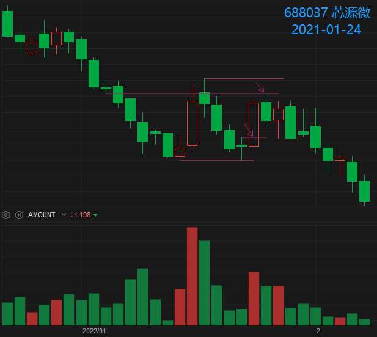
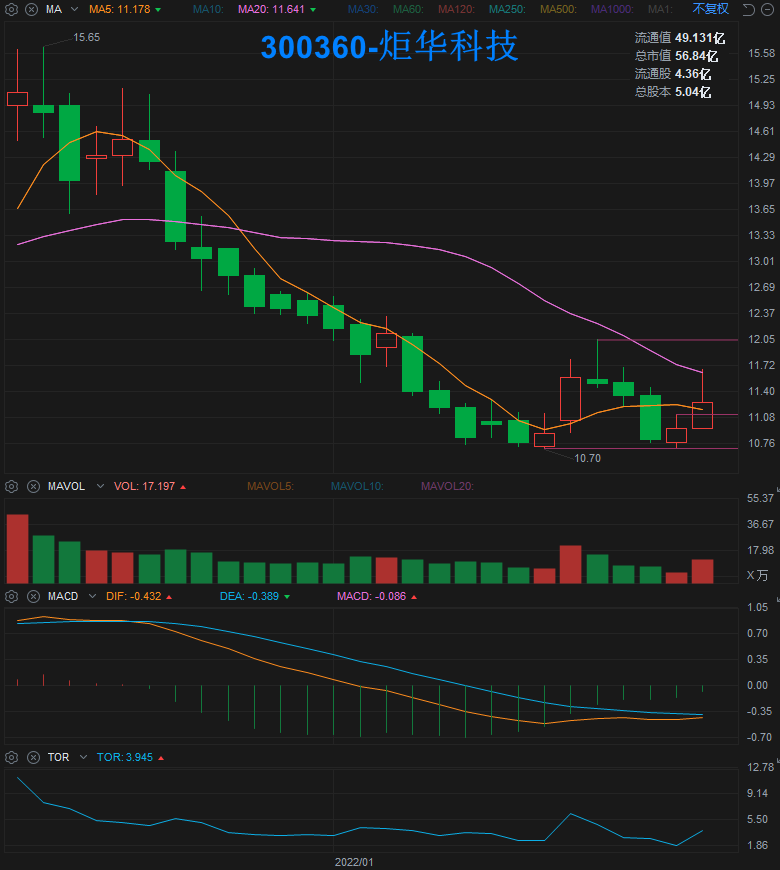

# 一二模型 Y0101 选股公式案例回测

点击 [这里](./Y0101-选股公式) 查看选股公式。

## 案例回测

| 选股日   | 上拐日   |      案例       |   1D    |   2D   |   3D   |
|:--------:|:--------:|:----------------|--------:|-------:|-------:|
| 22年1月
| 220121W5 | 220124W1 | 688037-芯源微   |  +8.60% | -3.36% | +2.25% |
| 220121W5 | 220124W1 | 300360-炬华科技 |  +2.96% | -6.29% | +6.33% |
| 22年5月
| 220527W5 |   -    | 002932-明德生物 |         |        |        |

- “选股日” 为盘后通过选股公式选出标的日期。
- “上拐日” 为标的选出后触发进场信号的日期，值为 “-” 代表没有触发进场信号。
- “220121W5” 为 “2022-01-21 周五” 的简写。
- 1D 为上拐进场当天的涨幅。

## 案例截图

### 2022-01-24 688037-芯源微

### 2022-01-24 300360-炬华科技

