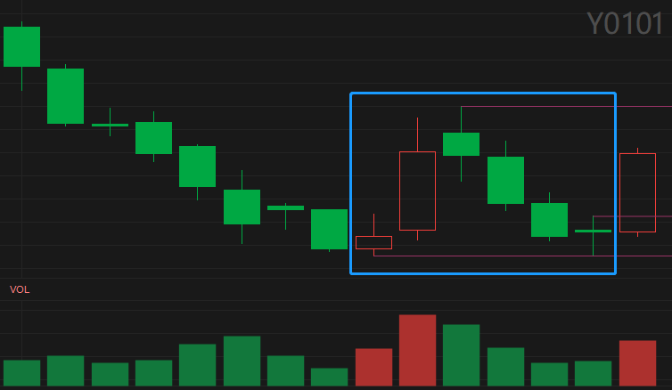

# 一二模型 Y0101 选股公式

适用于通达信。点击 [这里](./Y0101-案例回测.md) 查看此公式 `D=1` 的案例回测记录。

## 1. 概述

小阳加大阳反抽后缩量跌三天，第四天跌倒支撑附近，第五天上拐进。

## 2. K 线组合形态



> 来源：688037 芯源微 2022-01-24

## 3. 公式参数

- N：大阳当天距当前的周期数，`[4,1000]`，默认值 4 用于盘后选股，大于 4 用于回测。
- D：回调低点的允许偏差，`[1,5]`，默认值 1，表示允许偏差 ±1%。

## 4. 选股公式

```
{Y0101-v1.0 一二模型}

{排除 K 线数量不足的股票}
K_ENOUGH:=TOTALBARSCOUNT>N+20;

{N+1 日是小阳}
BOTTOM:=LLV(REF(L,N+1),20);
XIAO_YANG:=REF(C,N+1)>REF(C,N+2)  {阳线}
  AND REF(C,N+1)/REF(C,N+2)<=1.03 {涨幅<3%}
  {前 20 日一波跌，最大跌幅 >20%}
  AND HHV(REF(H,N+1),20)/BOTTOM>1.20
  {N+1 日接近一波跌的低点，偏差 ±D%}
  AND REF(L,N+1)/BOTTOM<=1+D/100
  AND REF(L,N+1)/BOTTOM>=1-D/100;

{N 天前大阳，涨幅 >6%}
DA_YANG:=REF(C,N)/REF(C,N+1)>=1.06;

{大阳后 4 天高低点连跌}
GD_LIAN_DIE:=LAST(C<REF(C,1),N-2,N-3) {收盘价连跌}
  {高点不断降低}
  AND LAST(H<REF(H,1),N-2,N-4)
  {低点不断降低}
  AND LAST(L<REF(L,1),N-2,N-4)
  {大阳后 3 天缩量}
  AND LAST(V<REF(V,1),N-2,N-3);

{N-4 日相对 N 日缩量}
N_SUB_4:=REF(V,N-4)<REF(V,N)
  {低点接近 N+1 日低点，偏差 ±D%}
  AND REF(L,N-4)/REF(L,N+1)<=1+D/100
  AND REF(L,N-4)/REF(L,N+1)>=1-D/100;

Y0101:K_ENOUGH AND XIAO_YANG AND DA_YANG AND GD_LIAN_DIE AND N_SUB_4;
```
