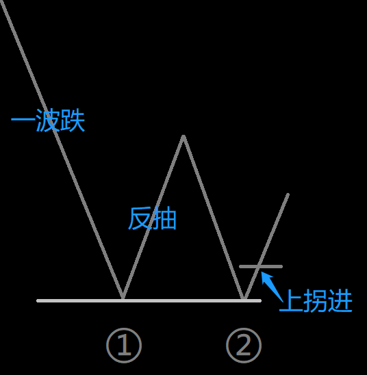
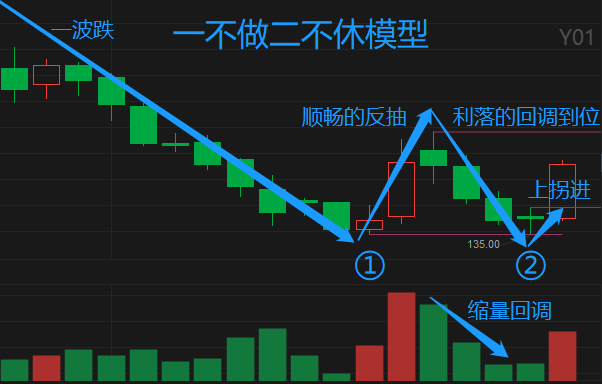
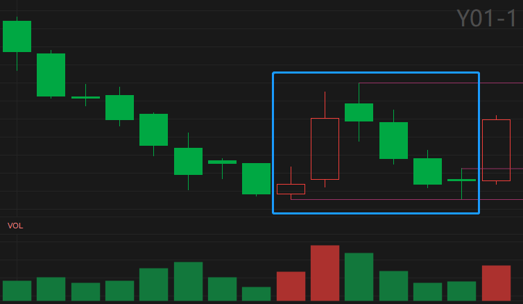
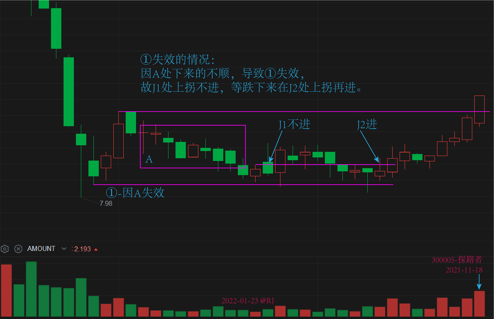
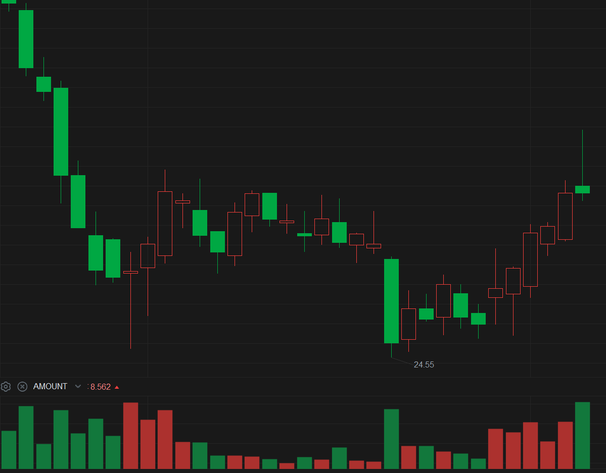
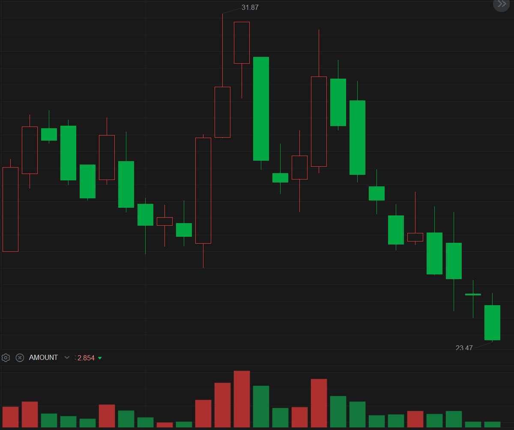
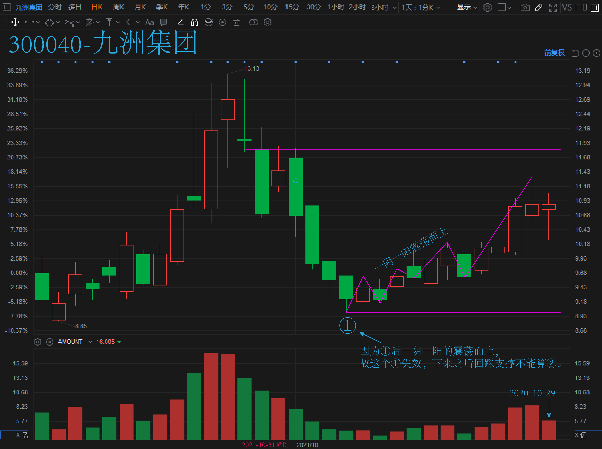

# Y01_一不做二不休

## 1. 模型特点

1. 一轮下跌后出现一个反抽，形成①。
2. 在反抽的最低处画一条线。
3. 反抽后回踩这条线，但没有被有效跌穿。
4. 第二天过左边的上盈线，形成②，进场。

**其它细节：**

- 反抽越顺，①越有效。
- 反抽上去的不顺，①失效。
    > 如连续阳线直接上去的，就是上去得很顺。
- 反抽下来的不顺，①也失效。
    > 如连续阴线直接下来的，就是下来得很顺。
- ①失效后，回踩反抽低点的上拐不能算②，要重新算①等②。

**特殊处理**：

1. ②处跌破后，横盘四五天再上去的，可进。

**解析说明**：

Q：为什么不做①做②？  
A：因为有了①后，②继续向上突破的可能性更高，上方空间才更大。如果①上面的空间够，也可以博弈。

## 2. 模型结构





## 3. 选股公式

### 3.1 Y01-1 选股公式

**概述：**

小阳加大阳反抽后缩量跌三天，第四天跌倒支撑附近，第五天上拐进。

**K 线组合形态：**



**公式参数：**

- N：大阳当天距当前的周期数，`[4,1000]`，默认值 4 用于盘后选股，大于 4 用于回测。
- D：回调低点的允许偏差，`[1,5]`，默认值 1，表示允许偏差 ±1%。

**选股公式：**

```
{Y01_一不做二不休 V1.0}

{排除 K 线数量不足的股票}
K_ENOUGH:=TOTALBARSCOUNT>N+20;

{N+1 日是小阳}
BOTTOM:=LLV(REF(L,N+1),20);
XIAO_YANG:=REF(C,N+1)>REF(C,N+2)  {阳线}
  AND REF(C,N+1)/REF(C,N+2)<=1.03 {涨幅<3%}
  {前 20 日一波跌，最大跌幅 >20%}
  AND HHV(REF(H,N+1),20)/BOTTOM>1.20
  {N+1 日接近一波跌的低点，偏差 ±D%}
  AND REF(L,N+1)/BOTTOM<=1+D/100
  AND REF(L,N+1)/BOTTOM>=1-D/100;

{N 天前大阳，涨幅 >6%}
DA_YANG:=REF(C,N)/REF(C,N+1)>=1.06;

{大阳后 4 天高低点连跌}
GD_LIAN_DIE:=LAST(C<REF(C,1),N-2,N-3) {收盘价连跌}
  {高点不断降低}
  AND LAST(H<REF(H,1),N-2,N-4)
  {低点不断降低}
  AND LAST(L<REF(L,1),N-2,N-4)
  {大阳后 3 天缩量}
  AND LAST(V<REF(V,1),N-2,N-3);

{N-4 日相对 N 日缩量}
N_SUB_4:=REF(V,N-4)<REF(V,N)
  {低点接近 N+1 日低点，偏差 ±D%}
  AND REF(L,N-4)/REF(L,N+1)<=1+D/100
  AND REF(L,N-4)/REF(L,N+1)>=1-D/100;

Y01:K_ENOUGH AND XIAO_YANG AND DA_YANG AND GD_LIAN_DIE AND N_SUB_4;
```

点击 [这里](./Y01-1-案例.md) 查看此公式 `D=1` 的案例回测记录。

## 4. 案例

### 4.1 ①失效的情况

下来的不顺：



①上去后有个较长时间的震荡区：



> 为什么不直接上去呢？因为①上去后上面有个较长时间的震荡区，回踩下面的支撑后，需要震荡一下消化上面的筹码先。

放量（倍量）低点是阻力，过了才能进：



一阴一阳震荡而上：


