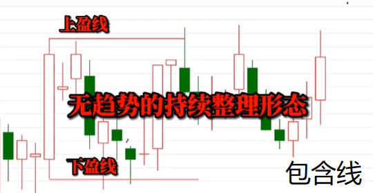
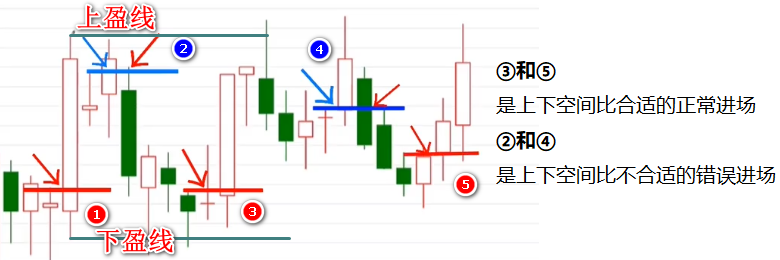
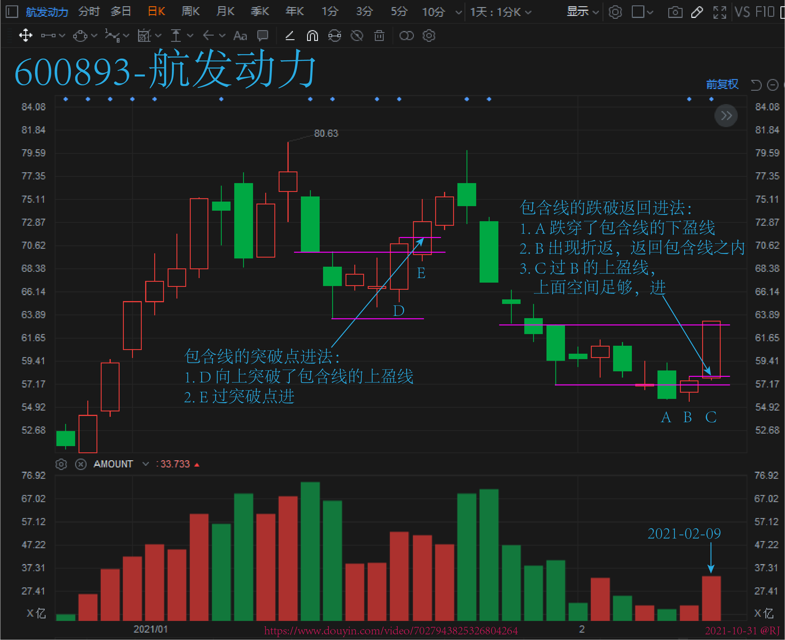
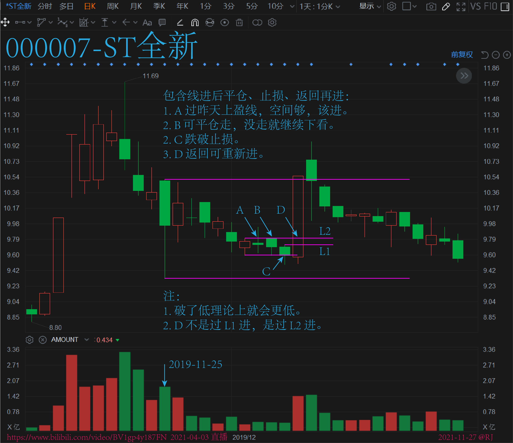

# 盈线模型之包含线

## 1. 模型特点

1. 左侧找最近振幅较大的 K 线（标记为 K1），此 K 线不分阴阳。
2. 在这根 K 线的最高和最低分别画上两条水平线，上面这条叫上盈线，下面这条叫下盈线。
3. 之后市场价格在这根 K 线的上下盈线间波动，形成无趋势的持续整理形态，K1 的上下盈线合称**包含线**，上下盈线间的波动就称为**包含线**内的波动。
4. 持续跟踪包含线内最后那根波动 K 线（标记为 K2）高点在包含线内的上下空间比（标记为 A）。
    >  K2 高点到 K1 高点的高度 H1 为上方空间大小，K2 高点到 K1 低点的高度 H2 为下方空间大小，A=H1/H2。
5. 当 A > 1 时，形成合适的空间比，在下一根 K 线突破 K2 高点时，就形成包含线的下方上拐，进场。
6. H1 为初始预期盈利空间，H2 为最大预期止损空间。
7. 当包含线没有被跌穿，而是其上盈线被突破（突破的这跟 K 线标记为 K3），在下一根 K 线突破 K3 高点时，如果上方也有空间，进场。进场后如果重新跌回包含线的上盈线则止损离场。

**补充细节：**

1. 上下空间比 A 越大，效果越好。
2. 上下空间比合适，但上方空间依然不足，如每次进场预期收益需在 5% 以上，但上方空间却小于 5%，则不建议参与。
3. 本质上每根 K 线都可以当作包含线，只是包不包得住和空间够不够的问题。
4. 因为空间的问题，**包含线内是尽量不参与的**，所以只有包含线振幅足够大，才有参与的价值。当**包含线跌穿返回**（价格跌破 K1 低点后重新返回到包含线内），上方空间最大，效果最好。
5. 包含线跌穿不返回，包含线失效。

## 2. 模型结构

  

## 3. 案例

### 3.1 包含线上下突破的两种进场方式

### 3.2 包含线进后跌破跑返回再进

