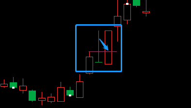
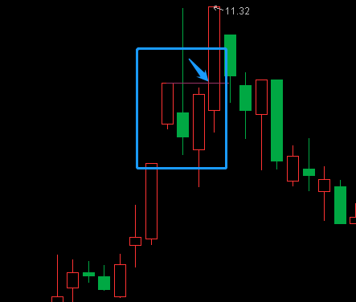
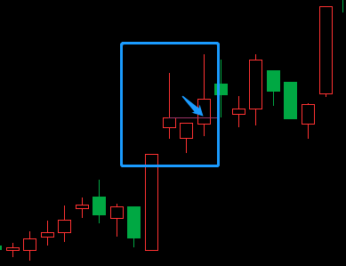

> [查看公式](./Y03-公式.md)、[查看案例](./Y03-案例.md)

# 长上影模型

这里的长上影特指突破型的长上影，不包括区间内的长上影。

## 1. 模型结构

## 2. 模型特点

1. 一轮上涨或横盘突破后出现一根带有长上影线的K线。
2. 上影线区间幅度足够大，至少 6%，以满足可能的盈利空间要求。
3. 上影线区间占整根 K 线高度的比例 ≥60%，越大越好。
4. 上影线高点为近期的最高点，即为突破型的长上影。
5. 上影线区间左侧没有明显的压力。

## 3. 进出场

- 进场：（三种方式）
    1. 盘后进场。
        > 适用于15分钟跌下来比较顺畅又没有有效跌破的。
    2. 第二天价格进入上影线下部区间进场。
        > 尽量避免使用。
    3. 等一天后，过上盈线进场。
        > 比较稳健的进场方式。
- 止盈：
    1. 突破上影线高点折返。
    2. 上涨过程中出现 K 线拐头。
    3. 突破昨高后折返。
- 止损：
    1. 跌破进场 K 线的低点。
    2. 如果跌破后离下方支撑位很近，等跌穿下方支撑位再止损。
- 平仓：跌破进场点。

## 4. 补充细节

**加分项：**

1. 15分钟跌下来比较顺畅的。
2. 15分钟上涨K线没有留下较长上影线的。
3. 上影线高点刚好在前期压力位附近的。

**减分项：**

1. 15分钟跌下来有较长横盘结构的。
2. 15分钟上涨K线也留下较长上影线的。
3. 爆量阴线型长上影。
