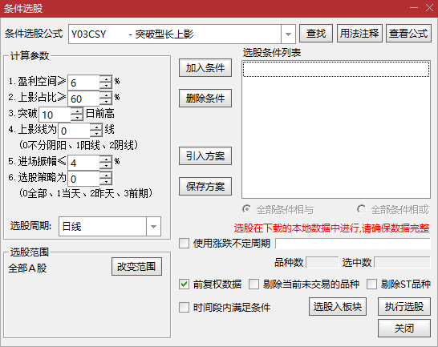

> [查看模型](./README.md)、[查看案例](./Y03-案例.md)

# 长上影模型公式

适用范围：通达信 PC 版及 APP。



## 1. 参数

| 编号 | 名称 | 最小值 | 最大值 | 缺省值 | 说明
|------|------|-------:|-------:|-------:|------
|   0  |   S  |      3 |     50 |      6 | 盈利空间≥S%
|   1  |   R  |     50 |    100 |     60 | 上影占比≥R%
|   2  |   N  |      2 |    100 |     10 | 突破N日前高
|   3  |   Y  |      0 |      2 |      0 | 上影线为Y线(0不分阴阳、1阳线、2阴线)
|   4  |   A  |      0 |     10 |      4 | 进场振幅≤A%
|   5  |   T  |      0 |      3 |      0 | 选股策略(0全部、1当天、2昨天、3前期)

参数精灵：

```txt
1.盈利空间≥Param#0%
2.上影占比≥Param#1%
3.突破Param#2日前高
4.上影线为Param#3线
  (0不分阴阳、1阳线、2阴线)
5.进场振幅≤Param#4%
6.选股策略为Param#5
  (0全部、1当天、2昨天、3前期)
```

用法注释：

```txt
编号：Y03
功能：找有机会进场的突破型长上影个股
选股策略：
- 0 当日及前期的长上影
- 1 当天的长上影
- 2 昨天的长上影
- 3 前期的长上影，即非当天的历史长上影
2022-06-21 @RJ
```

## 2. 选股公式

```txt
{长上影选股公式 2022-06-21 @RJ}

{长上影 K 线：当日长上影}
M:=MAX(C,O); {实体高点为影线起点}
NH:=HHV(H,N); {N周期内高点}
CSY:=IF(Y=0,1,IF(Y=1,C>=O,C<O))
  {1. 上影区间振幅不少于 S%}
  AND H/M>=1+S/100
  {2. 上影区间占整根 K 线高度的比例不少于 R%}
  AND (H-M)/(H-L)>=R/100
  {3. 突破型长上影}
  AND H=NH
  {4. 前 N 日的高点到上影高点振幅不少于 S%}
  AND (M>=NH OR H/REF(NH,1)>=1+S/100);

{前期长上影：在上影盈利空间下方徘徊等待突破的}
CSY_N:=BARSLAST(CSY); {长上影出现的位置}
CSY_PREVIOUS:=CSY_N>0
  AND REF(H,CSY_N)/HHV(H,CSY_N)>=1+S/100              {盈利空间要求}
  AND HHV(H,CSY_N)>=REF(MIN(C,O),CSY_N)               {有进入过影线实体的试探}
  AND MAX(REF(M,CSY_N),HHV(H,CSY_N))/C<=1+A/100       {进场振幅不大于A%}
  AND MIN(REF(L,CSY_N),REF(L,CSY_N+1))<=LLV(L,CSY_N); {未跌破影线前K低点}

{条件选股}
RUN:IF(T=0,CSY_N=0 OR CSY_PREVIOUS,  {当日及前期长上影}
    IF(T=1,CSY,                      {当日长上影}
    IF(T=2,CSY_N=1 AND CSY_PREVIOUS, {昨日长上影}
    IF(T=3,CSY_PREVIOUS,             {前期日长上影}
    0))));
```
